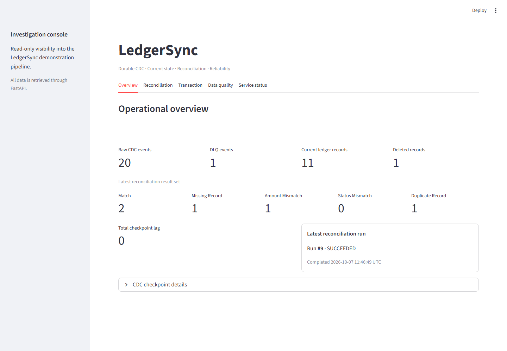
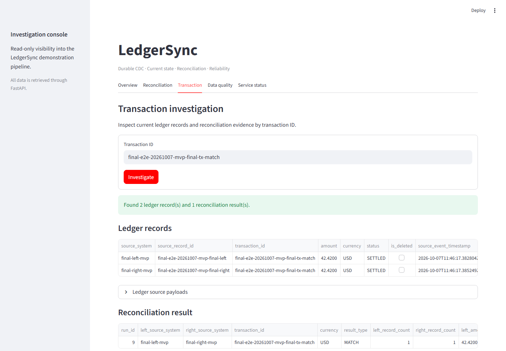
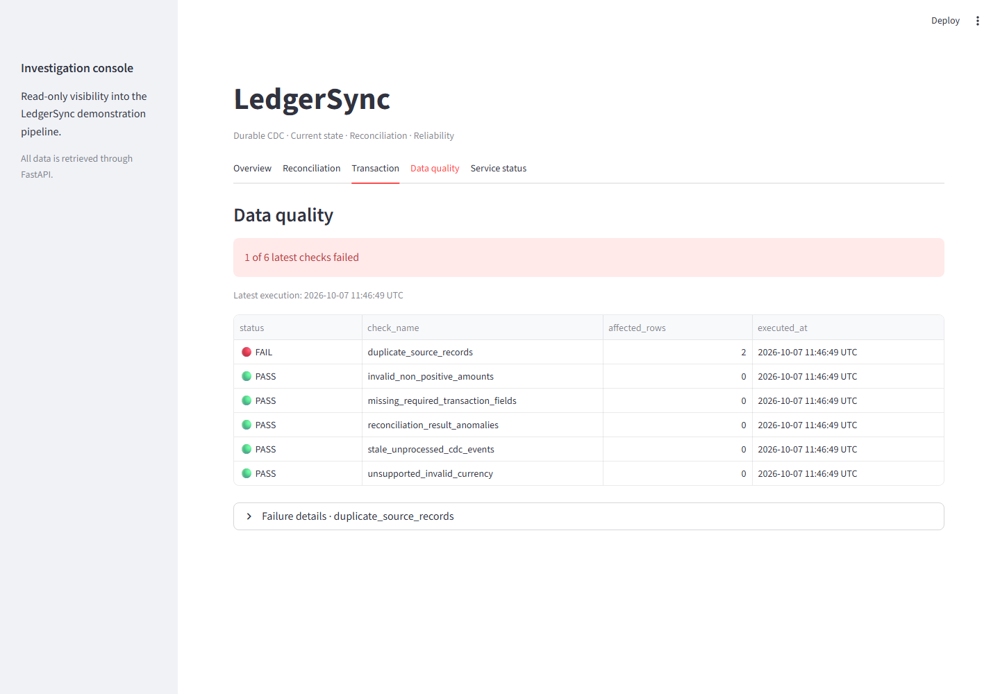
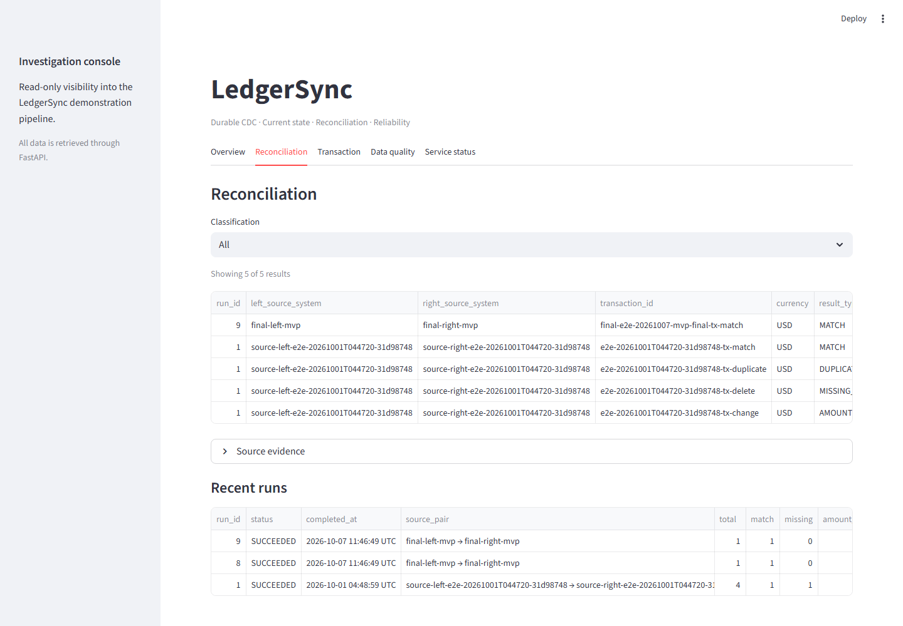

# LedgerSync

LedgerSync is a local, SQL-first demonstration of durable ledger change-data
capture and reconciliation. It streams PostgreSQL changes through Debezium and
Kafka, preserves immutable CDC evidence, maintains current ledger state,
reconciles two source systems, runs explicit data-quality checks, and exposes
read-only investigation endpoints.

All included ledger rows are synthetic demonstration data. The project is not
connected to a bank, payment processor, or other external production system.

## Architecture

```text
ledger_source.public.ledger_entries
        │ PostgreSQL logical replication / pgoutput
        ▼
Debezium Connect ──► Kafka CDC topics
        │
        ▼
Python ingestion ──► ingestion.raw_cdc_events / cdc_dead_letters
        │
        ▼
reconciliation.process_new_cdc_events()
        │
        ▼
reconciliation.ledger_current
        │
        ├──► reconciliation.run_reconciliation()
        │         └──► runs + current results
        └──► quality.run_checks() ──► quality.check_results
                                      │
                                      ▼
                              read-only FastAPI
                                      │
                                      ▼
                              Streamlit dashboard
```

The CDC topics are `ledgersync.cdc.public.cdc_smoke` and
`ledgersync.cdc.public.ledger_entries`. PostgreSQL and Kafka state live in
project-scoped named volumes and are not deleted by normal startup or tests.

## Components and resource limits

| Component | Purpose | Memory limit |
| --- | --- | ---: |
| PostgreSQL 16 | Source and LedgerSync databases | 448 MiB |
| Kafka 3.9 KRaft | Single-node event transport | 768 MiB |
| Debezium Connect 3.0 | PostgreSQL CDC connector | 640 MiB |
| Python ingestion | Durable raw event/DLQ writer | 192 MiB |
| FastAPI | Read-only investigation API | 128 MiB |
| Streamlit | Read-only investigation dashboard | 128 MiB |
| Migration job | Idempotent database migrations | 96 MiB |

The API, ingestion, and migration containers run as non-root with read-only
filesystems, dropped capabilities, and no-new-privileges. The API healthcheck
calls `/health`, which performs a live database query. Compose waits for
PostgreSQL health and successful migrations before starting the API.

## Reliability guarantees

- Debezium uses a persistent PostgreSQL replication slot and Kafka-backed
  connector state.
- Raw CDC history is immutable and deduplicated by Kafka
  `(topic, partition, offset)`.
- Kafka offsets are committed only after PostgreSQL persistence succeeds.
- Malformed events retain original bytes and failure details in the DLQ before
  their offsets are committed.
- Current-state upserts and per-partition checkpoint advancement commit in the
  same PostgreSQL transaction. Reprocessing an offset is idempotent.
- Deleted records remain in current state with CDC coordinates and source
  evidence, but are excluded from active reconciliation.
- Reconciliation result replacement is transactional. Failed runs preserve the
  preceding successful results and record a failed run summary.
- The API uses parameterized queries and a dedicated role with SELECT-only,
  read-only transactions.

## Reconciliation

`ledger_source.public.ledger_entries` provides stable source record and
transaction IDs, amount, currency, status, and an update timestamp. Current
state is keyed by `(source_system, source_record_id)` and retains the source
payload, timestamp, LSN, Kafka topic, partition, and offset.

`reconciliation.run_reconciliation(left_source, right_source)` matches active
records by `(transaction_id, currency)` and classifies them as:

- `MATCH`
- `MISSING_RECORD`
- `AMOUNT_MISMATCH`
- `STATUS_MISMATCH`
- `DUPLICATE_RECORD`

Each execution records a unique run with timestamps, status, totals, and counts
by classification. `reconciliation.results` contains the latest successful
result set per source pair; older runs retain summary history rather than full
result-detail snapshots.

## Data quality and metrics

Quality execution is intentionally explicit:

```powershell
docker compose exec -T postgres psql -U ledgersync_admin -d ledgersync `
  -c "SELECT quality.run_checks();"
```

Each run appends PASS/FAIL results, affected-row counts, timestamps, and concise
details for:

- Duplicate active source records
- Missing required transaction fields
- Missing, zero, or negative active amounts
- Invalid or unsupported currencies
- Reconciliation results inconsistent with their classification/run
- Raw CDC events more than five minutes beyond their processing checkpoint

Enabled demo currencies initially are EUR, GBP, INR, and USD in
`quality.supported_currencies`.

The metrics views expose raw CDC count, DLQ count, current/deleted ledger counts,
reconciliation counts by classification, latest run status/timestamps, and
per-topic/partition checkpoint lag:

- `quality.reliability_metrics`
- `quality.reconciliation_result_counts`
- `quality.cdc_checkpoint_lag`

## Streamlit dashboard

The dashboard binds to `http://127.0.0.1:8501`. It communicates only with the
FastAPI service (`Streamlit → FastAPI → PostgreSQL`) and receives no database
credentials. Its API base URL is configurable with
`LEDGERSYNC_API_BASE_URL` and defaults to `http://api:18000` in Docker.

Dashboard sections provide:

- An operational overview of CDC, DLQ, current/deleted ledger, reconciliation,
  checkpoint-lag, and latest-run metrics
- Filterable reconciliation results and recent run summaries
- Transaction-level ledger and reconciliation investigation
- Latest data-quality PASS/FAIL results with failure details
- API and database health with manual refresh

## Screenshots

All displayed transaction data is synthetic demo data. The mismatch, missing,
duplicate, update, and delete cases use deterministic fault injection so the
reconciliation and quality outcomes are reproducible.

**Operational dashboard** — CDC, DLQ, ledger, reconciliation, checkpoint, and
latest-run metrics.



**Reconciliation results** — current classifications with source evidence and
recent runs.


**Transaction investigation** — matching synthetic ledger records and their
reconciliation result.



**Data quality** — latest PASS/FAIL checks with affected-row counts.



**Run history** — source pairs, completion status, timestamps, and result
counts.



## Read-only API

The API binds to `http://127.0.0.1:18000` and exposes only GET routes:

- `/health`
- `/reconciliation/runs`
- `/reconciliation/results`
- `/ledger/{source_system}/{source_record_id}`
- `/transactions/{transaction_id}`
- `/quality/checks`
- `/metrics`

Runs, results, and quality checks support basic filters and pagination. Examples:

```powershell
Invoke-RestMethod http://localhost:18000/health
Invoke-RestMethod 'http://localhost:18000/reconciliation/runs?limit=10'
Invoke-RestMethod 'http://localhost:18000/reconciliation/results?result_type=MATCH'
Invoke-RestMethod 'http://localhost:18000/quality/checks?status=FAIL'
Invoke-RestMethod http://localhost:18000/metrics
```

## Local startup

Requirements are Docker Desktop with Linux containers, Compose v2.24+, and
Windows PowerShell. Allocate about 3.5 GB to Docker and keep ports 8501, 15432,
19092, 18083, and 18000 available.

Create the ignored local environment file and set four non-empty development
passwords:

```powershell
Copy-Item .env.example .env
# Set POSTGRES_PASSWORD, CDC_PASSWORD, INGEST_PASSWORD, and API_PASSWORD.
```

On the first run, provision and validate the CDC foundation:

```powershell
powershell -NoProfile -ExecutionPolicy Bypass -File .\infra\validate.ps1
```

The validator creates or reuses topics and the Debezium connector, sends one
unique smoke insert through PostgreSQL → Debezium → Kafka, records evidence
under ignored `.local/infra-validation/`, and preserves volumes. An optional
Docker-integrated WSL path remains available as `bash infra/validate.sh`.

Start the durable ingestion, API, and UI layers:

```powershell
docker compose up -d --build --wait ingestion api ui
docker compose ps
docker compose logs --tail=100 ingestion api ui ingestion-migrate
```

Open `http://127.0.0.1:8501` for the dashboard or
`http://127.0.0.1:18000/docs` for the read-only API documentation.

Stop containers while preserving all named volumes:

```powershell
docker compose down
```

Never use `docker compose down -v` when the preserved local evidence matters.

## Tests and CI

Focused Python tests:

```powershell
docker compose run --rm --no-deps -T ingestion `
  python -m unittest discover -s tests -p 'test_events.py' -v
docker compose run --rm --no-deps -T ingestion `
  python -m unittest discover -s tests -p 'test_storage.py' -v
docker compose run --rm --no-deps -T api `
  python -m unittest tests.test_api -v
```

Transactional SQL tests roll back their fixture data:

```powershell
$sqlTests = @(
  'tests/reconciliation.sql',
  'tests/incremental_reconciliation.sql',
  'tests/reconciliation_history.sql',
  'tests/quality.sql'
)
foreach ($test in $sqlTests) {
  Get-Content -Raw $test |
    docker compose exec -T postgres psql -U ledgersync_admin -d ledgersync
}
```

`.github/workflows/ci.yml` generates ephemeral credentials, validates Compose,
runs all focused Python tests, starts only PostgreSQL for the transactional SQL
suite, and checks whitespace. CI does not start Kafka or Debezium and requires
no repository secrets.

## Final local validation

On 2026-10-07, marker `final-e2e-20261007-mvp-final` passed the complete local
path: two synthetic source inserts became exactly two durable raw CDC records,
the incremental processor applied two records and then zero on retry, and two
reconciliation executions each returned one MATCH while retaining one current
result row. Quality stored five PASS results plus the expected duplicate-record
failure from the earlier demo fixture. The API returned the ledger, transaction,
run, result, quality, and metric evidence; both CDC checkpoint lags were zero.

## Project structure

```text
app/                         FastAPI application and container
ui/                          Streamlit investigation dashboard and API client
ingestion/                   Debezium parser, consumer, and durable storage
infra/debezium/              Connector and worker configuration
infra/postgres/              Source, ingestion, reconciliation, API, quality SQL
infra/validate.ps1           Windows end-to-end CDC validator
infra/validate.sh            Optional Bash validator
tests/                       Focused Python and transactional SQL tests
.github/workflows/ci.yml     Resource-conscious continuous integration
compose.yaml                 Local service topology and resource limits
```

## Known limitations

- The local Kafka and PostgreSQL deployment is single-node and has no failover.
- Kafka, Connect, and the API have no authentication; host ports bind to
  loopback and must not be exposed publicly.
- The Streamlit dashboard is a local demonstration UI without authentication;
  it must remain loopback-bound and relies on the API's current result views.
- Quality checks and reconciliation are manual SQL calls; there is no scheduler.
- The API uses offset pagination and provides current result details, not a full
  historical result-detail archive.
- The supported-currency set and five-minute stale threshold are demo defaults.
- Replication-slot WAL retention is capped at checkpoints; a sufficiently long
  outage can invalidate the slot and requires deliberate recovery.
- The synthetic ledger schema demonstrates the pipeline but is not a complete
  financial accounting model or integration with an external ledger.
